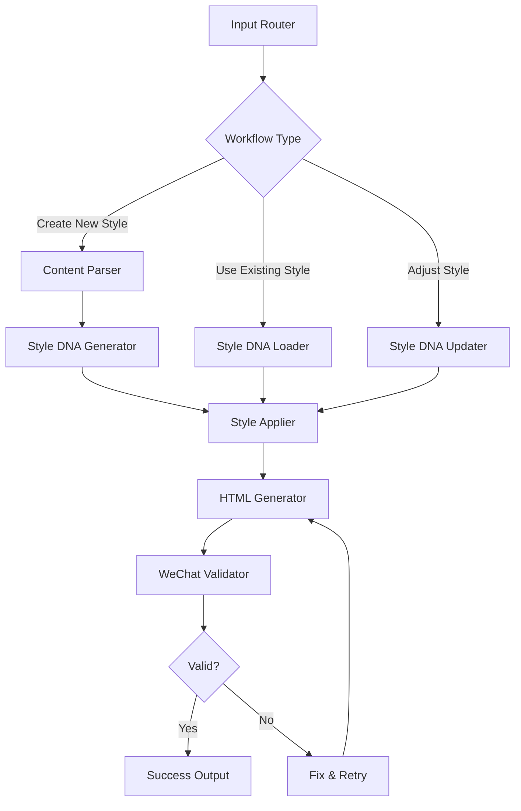

# AI 风格化内容生成服务 - LangChain + LangGraph 架构设计

## 架构概览

基于 LangChain + LangGraph 构建智能内容风格化系统，通过工作流编排实现用户文本到微信公众号 HTML 的智能转换。系统采用状态机工作流设计，支持三种核心场景的处理。

## 核心工作流设计

### 1. 主工作流架构 (MainStyleWorkflow)



### 2. 状态管理

```python
from typing import TypedDict, List, Dict, Optional
from enum import Enum

class WorkflowType(Enum):
    CREATE_NEW_STYLE = "create_new_style"
    USE_EXISTING_STYLE = "use_existing_style"
    ADJUST_STYLE = "adjust_style"

class ContentElement(TypedDict):
    type: str  # 'h1', 'h2', 'p', 'em', 'li', etc.
    content: str
    level: int

class StyleDNA(TypedDict):
    theme_name: str
    h1_styles: Dict[str, str]
    h2_styles: Dict[str, str]
    p_styles: Dict[str, str]
    em_styles: Dict[str, str]
    li_styles: Dict[str, str]
    section_styles: Dict[str, str]

class WorkflowState(TypedDict):
    # Input
    raw_content: str
    workflow_type: WorkflowType
    theme_name: Optional[str]
    theme_description: Optional[str]
    adjustment_request: Optional[str]
    
    # Processed Data
    parsed_content: List[ContentElement]
    style_dna: Optional[StyleDNA]
    generated_html: Optional[str]
    validation_errors: List[str]
    
    # Control Flow
    retry_count: int
    is_valid: bool
```

## LangChain 组件设计

### 1. 内容解析链 (Content Parser Chain)

```python
from langchain.prompts import PromptTemplate
from langchain.chains import LLMChain
from langchain.output_parsers import PydanticOutputParser

class ContentParserChain:
    def __init__(self, llm):
        self.parser = PydanticOutputParser(pydantic_object=ContentStructure)
        
        self.prompt = PromptTemplate(
            template="""
            分析以下文本内容的层次结构，识别标题、段落、强调文本、列表等元素：

            原始内容：
            {raw_content}

            请按照以下结构输出：
            {format_instructions}

            要求：
            1. 准确识别内容层次（H1、H2、正文、强调、列表等）
            2. 保持原始内容的语义完整性
            3. 为每个元素分配合适的重要级别
            """,
            input_variables=["raw_content"],
            partial_variables={"format_instructions": self.parser.get_format_instructions()}
        )
        
        self.chain = LLMChain(llm=llm, prompt=self.prompt, output_parser=self.parser)
```

### 2. 风格DNA生成链 (Style DNA Generator Chain)

```python
class StyleDNAGeneratorChain:
    def __init__(self, llm):
        self.prompt = PromptTemplate(
            template="""
            基于以下风格描述，生成符合微信公众号平台限制的风格DNA配置：

            风格主题：{theme_name}
            风格特征描述：{theme_description}
            内容结构：{content_structure}

            微信平台CSS限制：
            - 允许：font-size, color, font-weight, line-height, margin, padding, background-color, border, text-align, display
            - 禁止：position, transform, z-index, div标签, class/id属性
            - 必须：内联样式，使用section替代div

            生成JSON格式的风格DNA，包含各内容层次的样式配置：
            {{
              "theme_name": "{theme_name}",
              "h1_styles": {{"font-size": "24px", "color": "#2c3e50", ...}},
              "h2_styles": {{"font-size": "20px", "color": "#34495e", ...}},
              "p_styles": {{"font-size": "16px", "color": "#333333", ...}},
              "em_styles": {{"color": "#e74c3c", "font-style": "italic", ...}},
              "li_styles": {{"font-size": "16px", "margin-bottom": "8px", ...}},
              "section_styles": {{"margin": "20px 0", "padding": "16px", ...}}
            }}

            要求：
            1. 创造性地体现风格特征，避免模板化
            2. 严格遵循微信平台CSS限制
            3. 适配移动端阅读体验
            4. 保持视觉层次清晰
            """,
            input_variables=["theme_name", "theme_description", "content_structure"]
        )
        
        self.chain = LLMChain(llm=llm, prompt=self.prompt)
```

### 3. HTML生成链 (HTML Generator Chain)

```python
class HTMLGeneratorChain:
    def __init__(self, llm):
        self.prompt = PromptTemplate(
            template="""
            基于内容结构和风格DNA，生成符合微信公众号规范的HTML代码：

            内容结构：{parsed_content}
            风格DNA：{style_dna}

            微信HTML规范：
            1. 必须使用section替代div作为容器
            2. 所有样式必须内联（style属性）
            3. 禁用id属性，不使用class
            4. 只使用允许的HTML标签：p, h1-h6, section, ul, ol, li, strong, em, span
            5. 单位推荐：px, vw（避免百分比负值）

            输出格式：
            - 仅输出HTML内容片段，不包含完整页面结构
            - 每个内容元素应用对应的风格DNA样式
            - 确保在移动端显示良好

            HTML输出：
            """,
            input_variables=["parsed_content", "style_dna"]
        )
        
        self.chain = LLMChain(llm=llm, prompt=self.prompt)
```

### 4. 微信规范验证工具 (WeChat Validator Tool)

```python
from langchain.tools import Tool
import re
from bs4 import BeautifulSoup

class WeChatValidatorTool(Tool):
    name = "wechat_validator"
    description = "验证HTML是否符合微信公众号平台规范"
    
    def __init__(self):
        self.forbidden_tags = {'div', 'script', 'style', 'iframe', 'form', 'input'}
        self.forbidden_css = {'position', 'transform', 'z-index', '@media', '@keyframes'}
        self.required_inline_styles = True
    
    def _run(self, html_content: str) -> Dict[str, any]:
        errors = []
        soup = BeautifulSoup(html_content, 'html.parser')
        
        # 检查禁用标签
        for tag in soup.find_all():
            if tag.name in self.forbidden_tags:
                errors.append(f"发现禁用标签: <{tag.name}>")
            
            # 检查是否使用了id属性
            if tag.get('id'):
                errors.append(f"发现id属性: {tag.name}#{tag.get('id')}")
            
            # 检查内联样式
            if tag.get('style'):
                style_content = tag.get('style')
                for forbidden in self.forbidden_css:
                    if forbidden in style_content:
                        errors.append(f"发现禁用CSS属性: {forbidden}")
        
        # 检查是否使用section替代div
        if soup.find('div'):
            errors.append("发现div标签，应使用section替代")
        
        return {
            'is_valid': len(errors) == 0,
            'errors': errors,
            'suggestion': '请根据错误信息修正HTML代码' if errors else '验证通过'
        }
```

## LangGraph 节点实现

### 1. 核心节点定义

```python
from langgraph import Graph
from langgraph.graph import StateGraph, END

def create_style_workflow(llm):
    # 初始化链和工具
    content_parser = ContentParserChain(llm)
    style_generator = StyleDNAGeneratorChain(llm)
    html_generator = HTMLGeneratorChain(llm)
    validator = WeChatValidatorTool()
    
    # 定义节点函数
    def input_router(state: WorkflowState) -> Dict[str, any]:
        """路由到对应的工作流分支"""
        return {"workflow_type": state["workflow_type"]}
    
    def parse_content(state: WorkflowState) -> Dict[str, any]:
        """解析内容结构"""
        result = content_parser.chain.run(raw_content=state["raw_content"])
        return {"parsed_content": result.elements}
    
    def generate_style_dna(state: WorkflowState) -> Dict[str, any]:
        """生成新的风格DNA"""
        if state["workflow_type"] == WorkflowType.CREATE_NEW_STYLE:
            result = style_generator.chain.run(
                theme_name=state["theme_name"],
                theme_description=state["theme_description"],
                content_structure=state["parsed_content"]
            )
            return {"style_dna": result}
        return {}
    
    def load_existing_style(state: WorkflowState) -> Dict[str, any]:
        """加载已有风格DNA"""
        if state["workflow_type"] == WorkflowType.USE_EXISTING_STYLE:
            # 从数据库加载风格DNA
            style_dna = load_style_dna_from_db(state["theme_name"])
            return {"style_dna": style_dna}
        return {}
    
    def adjust_style_dna(state: WorkflowState) -> Dict[str, any]:
        """调整风格DNA"""
        if state["workflow_type"] == WorkflowType.ADJUST_STYLE:
            # 基于调整请求修改风格DNA
            updated_dna = adjust_style_with_llm(
                state["style_dna"], 
                state["adjustment_request"]
            )
            return {"style_dna": updated_dna}
        return {}
    
    def generate_html(state: WorkflowState) -> Dict[str, any]:
        """生成HTML"""
        result = html_generator.chain.run(
            parsed_content=state["parsed_content"],
            style_dna=state["style_dna"]
        )
        return {"generated_html": result}
    
    def validate_wechat_compliance(state: WorkflowState) -> Dict[str, any]:
        """验证微信平台合规性"""
        validation_result = validator._run(state["generated_html"])
        return {
            "is_valid": validation_result["is_valid"],
            "validation_errors": validation_result["errors"]
        }
    
    def fix_html_issues(state: WorkflowState) -> Dict[str, any]:
        """修复HTML合规问题"""
        if state["retry_count"] < 3:
            # 使用LLM修复问题
            fixed_html = fix_html_with_llm(
                state["generated_html"],
                state["validation_errors"]
            )
            return {
                "generated_html": fixed_html,
                "retry_count": state["retry_count"] + 1
            }
        else:
            # 超过重试次数，返回错误
            return {"is_valid": False}
    
    # 构建工作流图
    workflow = StateGraph(WorkflowState)
    
    # 添加节点
    workflow.add_node("input_router", input_router)
    workflow.add_node("parse_content", parse_content)
    workflow.add_node("generate_style_dna", generate_style_dna)
    workflow.add_node("load_existing_style", load_existing_style)
    workflow.add_node("adjust_style_dna", adjust_style_dna)
    workflow.add_node("generate_html", generate_html)
    workflow.add_node("validate_compliance", validate_wechat_compliance)
    workflow.add_node("fix_html", fix_html_issues)
    
    # 定义边和条件
    workflow.set_entry_point("input_router")
    
    workflow.add_edge("input_router", "parse_content")
    
    # 根据工作流类型分支
    workflow.add_conditional_edges(
        "parse_content",
        lambda x: x["workflow_type"].value,
        {
            "create_new_style": "generate_style_dna",
            "use_existing_style": "load_existing_style",
            "adjust_style": "adjust_style_dna"
        }
    )
    
    workflow.add_edge("generate_style_dna", "generate_html")
    workflow.add_edge("load_existing_style", "generate_html")
    workflow.add_edge("adjust_style_dna", "generate_html")
    
    workflow.add_edge("generate_html", "validate_compliance")
    
    # 验证结果分支
    workflow.add_conditional_edges(
        "validate_compliance",
        lambda x: "valid" if x["is_valid"] else "invalid",
        {
            "valid": END,
            "invalid": "fix_html"
        }
    )
    
    workflow.add_conditional_edges(
        "fix_html",
        lambda x: "retry" if x["retry_count"] < 3 else "failed",
        {
            "retry": "generate_html",
            "failed": END
        }
    )
    
    return workflow.compile()
```

## 服务接口设计

### 1. FastAPI 服务接口

```python
from fastapi import FastAPI, HTTPException
from pydantic import BaseModel

class CreateStyleRequest(BaseModel):
    raw_content: str
    theme_name: str
    theme_description: str

class UseStyleRequest(BaseModel):
    raw_content: str
    theme_name: str

class AdjustStyleRequest(BaseModel):
    theme_name: str
    adjustment_request: str

class StyleResponse(BaseModel):
    html_content: str
    style_dna: StyleDNA
    theme_name: str
    is_valid: bool
    errors: List[str]

app = FastAPI(title="AI Style Generation Service")

@app.post("/api/v1/styles/create", response_model=StyleResponse)
async def create_new_style(request: CreateStyleRequest):
    """创建新风格并生成HTML"""
    initial_state = {
        "raw_content": request.raw_content,
        "workflow_type": WorkflowType.CREATE_NEW_STYLE,
        "theme_name": request.theme_name,
        "theme_description": request.theme_description,
        "retry_count": 0
    }
    
    result = workflow.invoke(initial_state)
    
    if not result["is_valid"]:
        raise HTTPException(status_code=400, detail=result["validation_errors"])
    
    return StyleResponse(
        html_content=result["generated_html"],
        style_dna=result["style_dna"],
        theme_name=result["style_dna"]["theme_name"],
        is_valid=result["is_valid"],
        errors=result.get("validation_errors", [])
    )

@app.post("/api/v1/styles/apply", response_model=StyleResponse)
async def apply_existing_style(request: UseStyleRequest):
    """使用已有风格生成HTML"""
    initial_state = {
        "raw_content": request.raw_content,
        "workflow_type": WorkflowType.USE_EXISTING_STYLE,
        "theme_name": request.theme_name,
        "retry_count": 0
    }
    
    result = workflow.invoke(initial_state)
    return StyleResponse(
        html_content=result["generated_html"],
        style_dna=result["style_dna"],
        theme_name=result["style_dna"]["theme_name"],
        is_valid=result["is_valid"],
        errors=result.get("validation_errors", [])
    )
```

## 技术实现要点

### 1. 风格DNA存储

```python
# 使用SQLAlchemy + SQLite存储风格DNA
from sqlalchemy import create_engine, Column, Integer, String, Text, DateTime, Index
from sqlalchemy.ext.declarative import declarative_base
from sqlalchemy.orm import sessionmaker
import json
from datetime import datetime

Base = declarative_base()

class StyleDNAModel(Base):
    __tablename__ = "style_dnas"
    
    id = Column(Integer, primary_key=True)
    theme_name = Column(String(100), unique=True, nullable=False)
    dna_config = Column(Text, nullable=False)  # 存储风格DNA JSON字符串
    created_at = Column(DateTime, default=datetime.utcnow)
    updated_at = Column(DateTime, default=datetime.utcnow)
    
    # 索引
    __table_args__ = (
        Index('idx_theme_name', 'theme_name'),
    )

# 数据库连接配置
DATABASE_URL = "sqlite:///./style_dna.db"
engine = create_engine(DATABASE_URL, connect_args={"check_same_thread": False})
SessionLocal = sessionmaker(autocommit=False, autoflush=False, bind=engine)

# 创建表
Base.metadata.create_all(bind=engine)
```

### 2. 简化缓存机制

```python
# 使用内存缓存替代Redis
from functools import lru_cache
import json
from typing import Optional

class StyleDNACache:
    def __init__(self):
        self._cache = {}
        self.max_size = 100  # 最大缓存数量
    
    def get_style_dna(self, theme_name: str) -> Optional[dict]:
        return self._cache.get(theme_name)
    
    def set_style_dna(self, theme_name: str, style_dna: dict):
        # 简单的LRU逻辑
        if len(self._cache) >= self.max_size:
            # 删除最旧的一个
            oldest_key = next(iter(self._cache))
            del self._cache[oldest_key]
        
        self._cache[theme_name] = style_dna
    
    def clear(self):
        self._cache.clear()

# 全局缓存实例
style_cache = StyleDNACache()
```

### 3. 数据库操作服务

```python
from sqlalchemy.orm import Session
from typing import Optional

class StyleDNAService:
    def __init__(self, db: Session):
        self.db = db
    
    def create_style_dna(self, theme_name: str, style_dna: dict) -> StyleDNAModel:
        """创建新的风格DNA"""
        db_style = StyleDNAModel(
            theme_name=theme_name,
            dna_config=json.dumps(style_dna, ensure_ascii=False)
        )
        self.db.add(db_style)
        self.db.commit()
        self.db.refresh(db_style)
        
        # 更新缓存
        style_cache.set_style_dna(theme_name, style_dna)
        return db_style
    
    def get_style_dna(self, theme_name: str) -> Optional[dict]:
        """获取风格DNA，优先从缓存"""
        # 先检查缓存
        cached = style_cache.get_style_dna(theme_name)
        if cached:
            return cached
        
        # 从数据库获取
        db_style = self.db.query(StyleDNAModel).filter(
            StyleDNAModel.theme_name == theme_name
        ).first()
        
        if db_style:
            style_dna = json.loads(db_style.dna_config)
            # 更新缓存
            style_cache.set_style_dna(theme_name, style_dna)
            return style_dna
        
        return None
    
    def update_style_dna(self, theme_name: str, style_dna: dict) -> Optional[StyleDNAModel]:
        """更新风格DNA"""
        db_style = self.db.query(StyleDNAModel).filter(
            StyleDNAModel.theme_name == theme_name
        ).first()
        
        if db_style:
            db_style.dna_config = json.dumps(style_dna, ensure_ascii=False)
            db_style.updated_at = datetime.utcnow()
            self.db.commit()
            
            # 更新缓存
            style_cache.set_style_dna(theme_name, style_dna)
            return db_style
        
        return None
    
    def list_themes(self) -> List[str]:
        """获取所有主题名称列表"""
        themes = self.db.query(StyleDNAModel.theme_name).all()
        return [theme[0] for theme in themes]

# 数据库依赖
def get_db():
    db = SessionLocal()
    try:
        yield db
    finally:
        db.close()
```

### 4. 错误处理和重试机制

```python
class StyleGenerationError(Exception):
    """风格生成相关错误"""
    pass

class WeChatComplianceError(Exception):
    """微信平台合规性错误"""
    pass

# 在LangGraph节点中集成错误处理
def generate_html_with_retry(state: WorkflowState) -> Dict[str, any]:
    max_retries = 3
    for attempt in range(max_retries):
        try:
            result = html_generator.chain.run(
                parsed_content=state["parsed_content"],
                style_dna=state["style_dna"]
            )
            return {"generated_html": result, "retry_count": attempt}
        except Exception as e:
            if attempt == max_retries - 1:
                raise StyleGenerationError(f"HTML生成失败: {str(e)}")
            continue
```

## 监控和日志

### 1. 简单的本地日志记录

```python
import logging
import time
from datetime import datetime
from functools import wraps
from typing import Dict, Any
import json

# 配置日志
logging.basicConfig(
    level=logging.INFO,
    format='%(asctime)s - %(name)s - %(levelname)s - %(message)s',
    handlers=[
        logging.FileHandler('style_generation.log'),
        logging.StreamHandler()
    ]
)

logger = logging.getLogger('style_generation')

class WorkflowMonitor:
    def __init__(self):
        self.execution_stats = {
            'total_executions': 0,
            'success_count': 0,
            'error_count': 0,
            'workflow_types': {},
            'avg_duration': 0,
            'last_executions': []
        }
    
    def log_execution(self, workflow_type: str, duration: float, status: str, error_msg: str = None):
        """记录工作流执行情况"""
        self.execution_stats['total_executions'] += 1
        
        if status == 'success':
            self.execution_stats['success_count'] += 1
        else:
            self.execution_stats['error_count'] += 1
        
        # 记录各类型工作流统计
        if workflow_type not in self.execution_stats['workflow_types']:
            self.execution_stats['workflow_types'][workflow_type] = {
                'count': 0,
                'success': 0,
                'error': 0,
                'avg_duration': 0
            }
        
        type_stats = self.execution_stats['workflow_types'][workflow_type]
        type_stats['count'] += 1
        type_stats[status] += 1
        type_stats['avg_duration'] = (type_stats['avg_duration'] * (type_stats['count'] - 1) + duration) / type_stats['count']
        
        # 更新总体平均时长
        self.execution_stats['avg_duration'] = (
            self.execution_stats['avg_duration'] * (self.execution_stats['total_executions'] - 1) + duration
        ) / self.execution_stats['total_executions']
        
        # 记录最近执行记录（保留最近10条）
        execution_record = {
            'timestamp': datetime.now().isoformat(),
            'workflow_type': workflow_type,
            'duration': duration,
            'status': status,
            'error_msg': error_msg
        }
        
        self.execution_stats['last_executions'].append(execution_record)
        if len(self.execution_stats['last_executions']) > 10:
            self.execution_stats['last_executions'].pop(0)
        
        # 记录日志
        log_msg = f"工作流执行: {workflow_type}, 耗时: {duration:.2f}s, 状态: {status}"
        if error_msg:
            log_msg += f", 错误: {error_msg}"
        
        if status == 'success':
            logger.info(log_msg)
        else:
            logger.error(log_msg)
    
    def get_stats(self) -> Dict[str, Any]:
        """获取执行统计信息"""
        return self.execution_stats.copy()

# 全局监控实例
workflow_monitor = WorkflowMonitor()

def monitor_workflow(func):
    """工作流监控装饰器"""
    @wraps(func)
    def wrapper(workflow_type: WorkflowType, initial_state: Dict, *args, **kwargs):
        start_time = time.time()
        status = 'success'
        error_msg = None
        
        try:
            result = func(workflow_type, initial_state, *args, **kwargs)
            return result
        except Exception as e:
            status = 'error'
            error_msg = str(e)
            logger.exception(f"工作流执行失败: {workflow_type.value}")
            raise
        finally:
            duration = time.time() - start_time
            workflow_monitor.log_execution(workflow_type.value, duration, status, error_msg)
    
    return wrapper

@monitor_workflow
def execute_style_workflow(workflow_type: WorkflowType, initial_state: Dict):
    """执行风格生成工作流"""
    return workflow.invoke(initial_state)
```

### 2. 简单的状态监控API

```python
# 添加到FastAPI应用中
@app.get("/api/v1/monitor/stats")
async def get_monitor_stats():
    """获取监控统计信息"""
    return workflow_monitor.get_stats()

@app.get("/api/v1/monitor/health")
async def health_check():
    """健康检查"""
    try:
        # 检查数据库连接
        db = next(get_db())
        db.execute("SELECT 1")
        db.close()
        
        stats = workflow_monitor.get_stats()
        
        return {
            "status": "healthy",
            "database": "connected",
            "total_executions": stats['total_executions'],
            "success_rate": stats['success_count'] / max(stats['total_executions'], 1) * 100,
            "uptime": datetime.now().isoformat()
        }
    except Exception as e:
        return {
            "status": "unhealthy",
            "error": str(e),
            "timestamp": datetime.now().isoformat()
        }
```

## 环境配置

### 1. 项目依赖

```bash
# requirements.txt
fastapi==0.104.1
uvicorn[standard]==0.24.0
sqlalchemy==2.0.23
langchain==0.0.350
langgraph==0.0.66
pydantic==2.5.0
python-multipart==0.0.6
beautifulsoup4==4.12.2
openai==1.3.7
python-dotenv==1.0.0
```

### 2. 环境变量配置

```bash
# .env 文件
OPENAI_API_KEY=your_openai_api_key
DATABASE_URL=sqlite:///./style_dna.db

# 可选的调试配置
DEBUG=true
LOG_LEVEL=INFO
```

### 3. 启动配置

```python
# main.py
import os
from dotenv import load_dotenv
from fastapi import FastAPI
from contextlib import asynccontextmanager

# 加载环境变量
load_dotenv()

@asynccontextmanager
async def lifespan(app: FastAPI):
    # 启动时初始化数据库
    Base.metadata.create_all(bind=engine)
    print("数据库初始化完成")
    yield
    # 关闭时清理资源
    style_cache.clear()
    print("应用关闭完成")

app = FastAPI(
    title="AI Style Generation Service",
    version="1.0.0",
    lifespan=lifespan
)

# 启动命令
if __name__ == "__main__":
    import uvicorn
    uvicorn.run(
        "main:app", 
        host="127.0.0.1", 
        port=8000, 
        reload=True
    )
```

## 总结

本架构设计基于 LangChain + LangGraph 构建了一个实用的AI风格化内容生成系统，具备以下特点：

1. **轻量化架构**：使用SQLite作为数据库，内存缓存替代Redis，降低部署复杂度
2. **模块化设计**：清晰的组件分离，易于维护和扩展
3. **工作流驱动**：基于LangGraph的状态机工作流，处理复杂业务逻辑
4. **微信规范优先**：内置验证机制确保生成内容符合平台要求
5. **错误恢复**：自动重试和修复机制提高系统健壮性
6. **快速启动**：简化的配置和依赖，支持本地开发和测试

该架构专注于核心功能的快速实现，避免了过度设计，为AI风格化内容生成提供了简洁可靠的技术基础。后续可根据需要升级到PostgreSQL和Docker化部署。